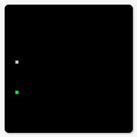

# Will it Learn? That is the question

This project was an attempt on making Genetic Programs. Imagine you want to solve a problem but you have no idea how, but know how to calculate how good is a solution... Genetic Program is an approach on letting another program generate a code that may solve your problem in an non optimal way.

Genetic Programming is based on evolution and natural selection: you have programs, you test the programs, select which ones were best, breed them creating mutations and go back to testing with the new generation of programs.

This project tried to achieve this by doing the following:
1. Generate a first set of random programs
2. Execute each of those programs
3. Calculate a score (fitness) for each of those programs (that is, given the program's result, how good it did)
4. Select the programs that will be used to create the next generation of programs
  In this approach I used the two best ones initially. I wanted to make this quickly :)
5. Create new programs using the traits of the selected programs in the previous step
6. Randomly mutate the new programs
7. Go back to step 2

### Example

This approach was tested on a scenery in which an autonomous player starts at a random position and should get to a goal:

This is the example in the `examples` directory.
